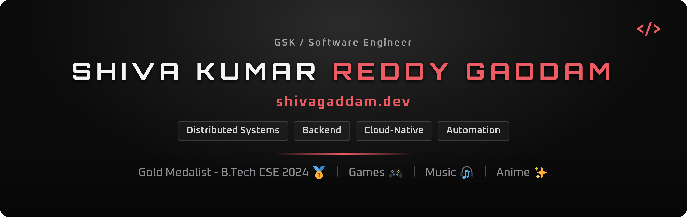
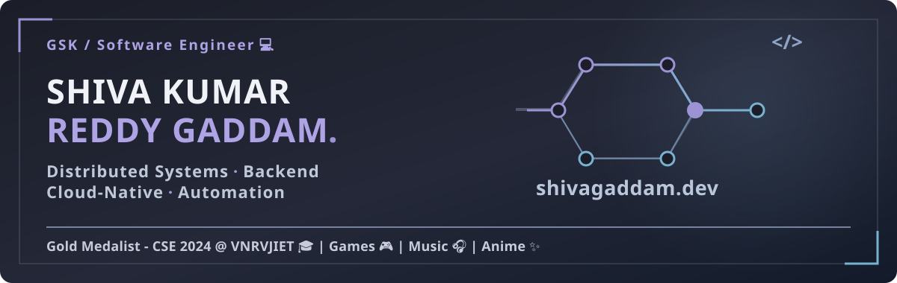

  

<!-- ALTERNATE BANNER: Uncomment this block and comment out the PNG banner above to switch.

  

-->

  
  &nbsp;
  
  &nbsp;
  
  &nbsp;
  

Software engineer focused on **backend and distributed systems**. Spent nearly two years in Oracle Communications working across service-activation workflows, automation, Linux environments, and cloud-native deployments. I also debugged failures across services, databases, messaging, and deployment tooling.

## 01 / Experience

**Oracle Communications · Automation & Infrastructure**  
*Project Intern, then full-time · January 2024 – October 2025*

- Automated service-activation regression workflows using LISA across web services, JMS/XML, LDAP, and dynamic routing.
- Supported platform upgrades across **three private Kubernetes clusters** using Kubernetes, Helm, and Podman.
- Investigated failures across Linux environments, service configuration, messaging, SSL, and Oracle DB.

[Read the engineering case studies →](https://shivagaddam.dev/#work)

## 02 / Projects

| Project | What to explore |
| --- | --- |
| [Professional Networking Platform](https://shivagaddam.dev/#projects) | Active backend learning project using Spring Boot services, JWT, Kafka, Neo4j, and PostgreSQL. |
| [Speaker Diarization System](https://github.com/GSK-10/speaker-diarization-system) | Python and Flask pipeline for multi-speaker diarization and timestamped transcription. |
| [Engineering portfolio](https://github.com/GSK-10/shiva-gaddam-portfolio) | The site implementation: Next.js, TypeScript, accessible interactions, and work case studies. |

## 03 / Technical Skills

### Top 10 Skills:

  
  
  
  
  

**C++ · Java · Python · SQL · Linux · Docker · Kubernetes · REST APIs · Spring Boot · AWS**

### Complete Skills:

**Languages:** C/C++ · Java · Python · JavaScript · SQL · Bash/Shell  
**Frameworks & APIs:** Spring Boot · Spring Data JPA · REST APIs · Flask · Node.js · React  
**Databases & Messaging:** Oracle DB · MySQL · PostgreSQL · Neo4j · Kafka · JMS  
**Cloud & Infrastructure:** AWS · GCP · OCI · Linux · Kubernetes · Docker · Podman · Helm  
**Developer Tools:** Git · GitLab · IntelliJ IDEA · Postman · LISA · Cline

<!-- ALTERNATE SKILLS VIEW: Comment out the Complete Skills block above, then remove this block's opening and closing comment markers to show Top 10 plus illustrated categories.

### Top 10 Skills

  
  
  
  
  

**C++ · Java · Python · SQL · Linux · Docker · Kubernetes · REST APIs · Spring Boot · AWS**

### Languages

C/C++ · Java · Python · JavaScript · SQL · Bash/Shell

### Frameworks & APIs

Spring Boot · Spring Data JPA · REST APIs · Flask · Node.js · React

### Databases & Messaging

Oracle DB · MySQL · PostgreSQL · Neo4j · Kafka · JMS

### Cloud & Infrastructure

AWS · GCP · OCI · Linux · Kubernetes · Docker · Podman · Helm

### Developer Tools

Git · GitLab · IntelliJ IDEA · Postman · LISA · Cline

-->

## 04 / Current Focus

- Building a **Java and Spring Boot** professional networking platform with JWT-protected routes, service discovery, Kafka events, Neo4j, and PostgreSQL. This is an active learning project.
- Deepening my understanding of **distributed systems** through service boundaries, asynchronous flows, failure handling, and practical debugging.
- Developing **AWS and GCP** knowledge while drawing on hands-on Linux and Kubernetes platform work at Oracle.

## 05 / Education

**B.Tech in Computer Science & Engineering** · VNR VJIET, Hyderabad · 2020–2024  
**CGPA:** 9.52/10

## 06 / Achievements & Research

- **Gold Medalist**, Computer Science & Engineering, VNR VJIET (2024).
- **LeetCode Knight**, peak rating 2036 · **CodeChef 3 Star**.
- Co-authored [research on speaker diarization and audio processing](https://www.internationaljournalssrg.org/IJEEE/paper-details?Id=1043), published in *SSRG International Journal of Electrical and Electronics Engineering* (2025). 

Open to **backend, platform, and infrastructure engineering** roles. Oracle work is described through [sanitized case studies](https://shivagaddam.dev/#work); the public repositories above are personal or academic projects.
